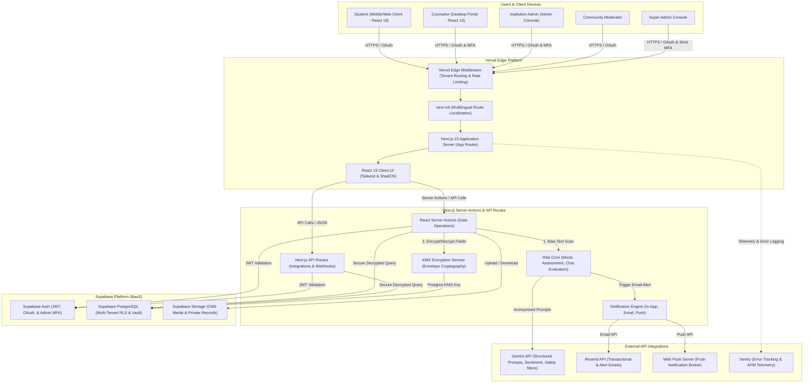
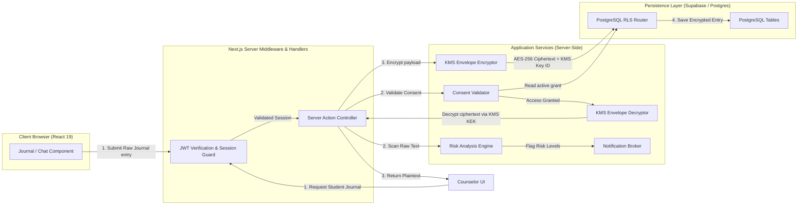
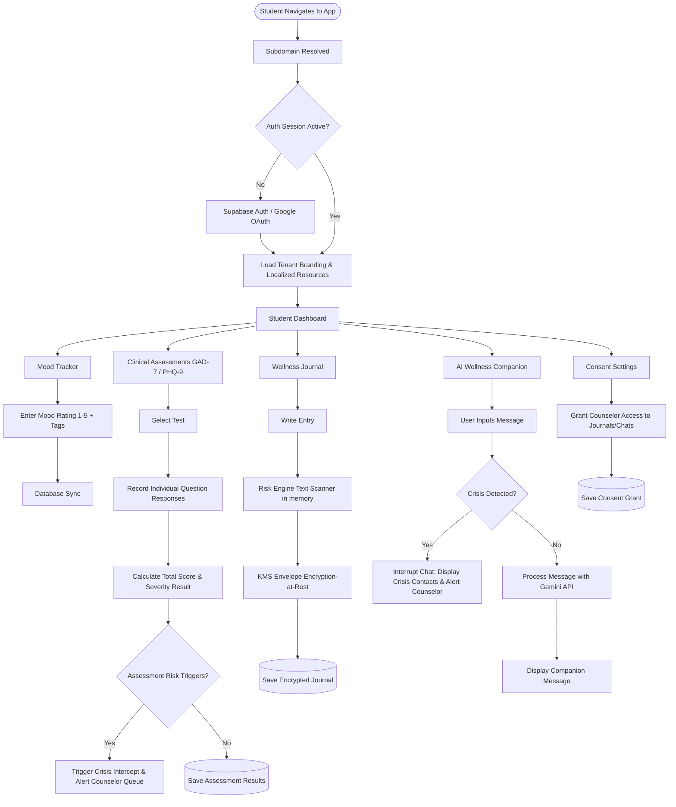
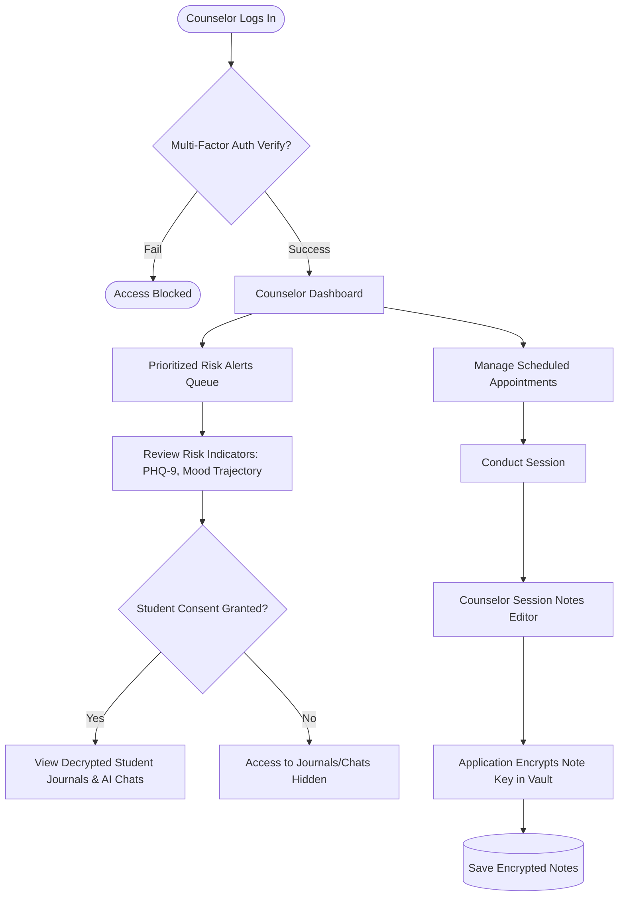
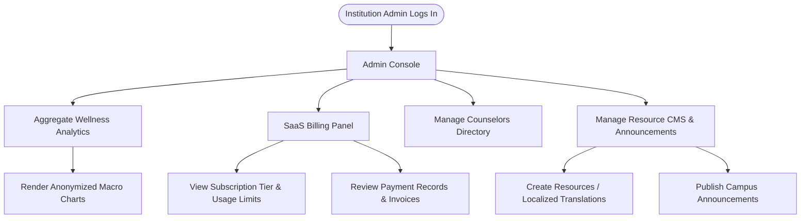
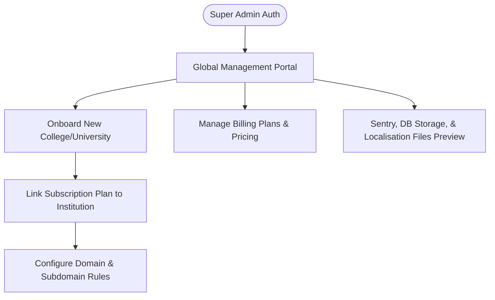
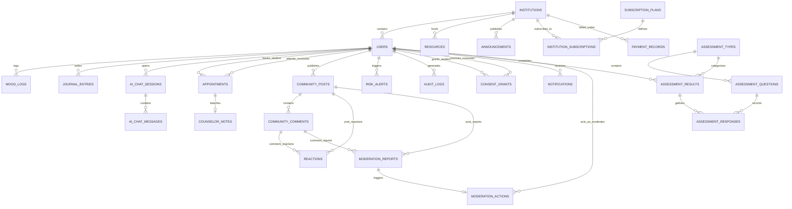
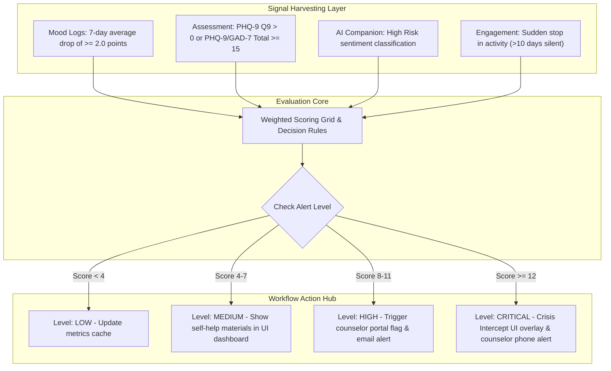

# MindSpire Architecture Specification - Phase 1 (Revised)

This document outlines the enterprise-grade, multi-tenant digital mental wellness platform **MindSpire ("Empowering Minds, Enabling Change")**, designed for colleges and universities. The platform enforces strict data privacy, multi-tenant isolation, ethical AI workflows, robust clinical risk mitigation, and security-first data models to support real-world student and counselor interaction.

---

## 1. Executive Architecture Overview

MindSpire is designed as a secure, high-availability, multi-tenant Software-as-a-Service (SaaS) platform tailored to the educational sector. It leverages a modern serverless and edge-optimized architecture to deliver a calm, warm, and highly secure digital space for student mental wellness, while providing counselors and administrators with the oversight needed to ensure student safety.

### 1.1 Architectural Pillars
1. **Student Privacy**: Enforces dual user identities (pseudonyms for community interaction and official credentials for clinical bookings). Private journal entries and AI conversation history are shielded using application-layer server encryption-at-rest. Under no circumstances can university administrators access individual journals, chats, or counselor clinical notes.
2. **Consent-Based Sharing**: Establishes student agency. Students can dynamically authorize counselors to view their journal logs or AI chat histories. These grants are audited, time-bound, and fully revocable.
3. **Security & Compliance**: Enforces FERPA and HIPAA alignment. Row Level Security (RLS) locks data within PostgreSQL, preventing cross-tenant access at the SQL query level.
4. **Clinical Safety & Automated Risk Scans**: The Gemini-powered wellness companion provides conversational coping support but does not diagnose. It runs alongside an in-memory Risk Engine scanning text inputs for distress signals, suicidal ideation, or self-harm keywords prior to DB-level encryption.
5. **SaaS Multi-Tenancy**: Built on a single-database, logically segregated model supporting unique domains, customized styling themes, localized resources, and tiered subscriptions.

---

## 2. High-Level System Architecture Diagram

The system follows an **Edge-to-Database** flow, utilizing Vercel's Edge network for fast page delivery and global API routing, while routing stateful requests to a multi-tenant Supabase PostgreSQL database.



---

## 3. Low-Level Architecture Diagram

The low-level service design highlights service interactions during core operations: journaling with server-side envelope encryption, consent-based checking, and notification alerts.



---

## 4. Multi-Tenant Architecture Design

MindSpire uses a **shared database, logically segregated (Single-Database, Multi-Tenant)** model. This design ensures resource utilization efficiency while maintaining absolute data segregation.

### 4.1 Tenant Resolution and Context Propagation
* **Subdomain Mapping**: Next.js Edge Middleware intercepts inbound traffic to extract host subdomains (e.g. `columbia.mindspire.app`).
* **JWT Custom Metadata Injection**: Users hold an `institution_id` inside their Supabase metadata. When querying the database, this token validates the identity and boundary.
* **RLS Policies**: Imposed on every table, checking incoming user claims against the targeting record’s `institution_id`.
  ```sql
  CREATE POLICY tenant_isolation_policy ON public.mood_logs
    FOR ALL
    TO authenticated
    USING (institution_id = (auth.jwt() -> 'user_metadata' ->> 'institution_id')::uuid);
  ```

### 4.2 Application-Level Server-Side Encryption-at-Rest
To allow the server-side Risk Engine to scan text content for self-harm or depression triggers, client-side encryption is replaced with a robust **Server-Side Envelope Encryption-at-Rest Architecture**:

1. **In-Memory Buffer Processing**: The server action receives the raw journal text over HTTPS. It passes it to the Risk Engine in volatile execution memory.
2. **Envelope Encryption**:
   * The server generates a unique **Data Encryption Key (DEK)** (AES-256) for the record.
   * The journal text is encrypted using the DEK via AES-256-GCM.
   * The DEK is encrypted using a **Key Encryption Key (KEK)** managed within the Supabase Vault/AWS KMS provider.
   * The encrypted content (`encrypted_content`) and the encrypted DEK (`encrypted_dek`) are saved to the database.
3. **Memory Flush**: Cleartext is immediately garbage-collected from execution memory, ensuring no sensitive data is written to Sentry error trackers or Vercel persistent logs.

### 4.3 Consent-Based Access Control
To permit counselors to view a student's logs during active therapy cycles, a consent-management system is built:
* **The Consent Grant**: Students toggle sharing settings on their dashboard. This logs an active record in the `consent_grants` table containing the counselor ID, the scope (`journals`, `ai_chats`, or `both`), and an expiration timestamp.
* **Database Consent Enforcers**: In addition to standard owner RLS, journal and AI chat tables have policies matching active consent grants:
  ```sql
  CREATE POLICY counselor_consent_view_journals ON public.journal_entries
    FOR SELECT
    TO authenticated
    USING (
      (auth.jwt() -> 'user_metadata' ->> 'role' = 'counselor') AND
      EXISTS (
        SELECT 1 FROM public.consent_grants
        WHERE consent_grants.student_id = journal_entries.user_id
          AND consent_grants.counselor_id = auth.uid()
          AND consent_grants.grant_type IN ('journals', 'both')
          AND consent_grants.status = 'active'
          AND (consent_grants.expires_at IS NULL OR consent_grants.expires_at > now())
      )
    );
  ```

---

## 5. User Flow Diagrams

### 5.1 Student Portal User Flow
The student flow prioritizes accessibility, ease of wellness entry, privacy configuration, and crisis-prevention intercepts.



### 5.2 Counselor Portal User Flow
Focuses on student tracking, viewing prioritized risk alerts, and updating encrypted clinical notes.



### 5.3 Institution Admin Portal Flow
Enforces privacy boundaries. Access is limited to aggregated, non-identifiable institutional wellness trends, subscription billing, and counselor staff configuration.



### 5.4 Super Admin Portal Flow
Allows cross-tenant creation, subscription management, global platform monitoring, and feature flag controls.



---

## 6. Complete RBAC Matrix

MindSpire implements an enterprise-grade Role-Based Access Control (RBAC) model. The role permissions map directly to DB-level RLS policies.

| Role | Resource | Create | Read | Update | Delete | Operational Constraints / Scopes |
| :--- | :--- | :---: | :---: | :---: | :---: | :--- |
| **Student** | Own Profile | Yes | Yes | Yes | No | Profile creation occurs at registration; updating limited to demographic metadata. |
| **Student** | Own Mood Logs | Yes | Yes | No | No | Historic mood entries are write-once. |
| **Student** | Own Journal Entries | Yes | Yes | Yes | Yes | Decryption via server-side KMS execution. Checked against student ownership. |
| **Student** | Own AI Chats | Yes | Yes | No | Yes | Messages cannot be modified once sent. |
| **Student** | Own Appointments | Yes | Yes | No | Yes | Can book and cancel appointments. |
| **Student** | Counselor Notes | No | No | No | No | **Strict Exclusion**: Student can never access counselor notes. |
| **Student** | Assessment Data | Yes | Yes | No | No | Can read past results; cannot modify logged scores. |
| **Student** | Consent Grants | Yes | Yes | Yes | Yes | Full control to grant, modify, or revoke counselor view rights. |
| **Student** | Community Posts | Yes | Yes | Yes | Yes | Can choose to display pseudonym or standard profile handle. |
| **Student** | System Resources | No | Yes | No | No | Read-only access to articles and institutional support lists. |
| **Counselor** | Assigned Appointments | Yes | Yes | Yes | Yes | Can manage their calendar availability. |
| **Counselor** | Student Profiles | No | Yes | No | No | Can read profile metadata for assigned students (in their own institution only). |
| **Counselor** | Student Journals / AI Chats | No | Conditional| No | No | **Consent-Based**: Read-only access permitted ONLY if active `consent_grants` exists. |
| **Counselor** | Own Counselor Notes | Yes | Yes | Yes | No | Only the authoring counselor can write/read notes. Modification logged in audit trail. |
| **Counselor** | Risk Alerts | No | Yes | Yes | No | View alerts for their institution; can mark alerts as "Resolved". |
| **Institution Admin**| Counselor Directory | Yes | Yes | Yes | Yes | Manage counselor staff roster for their respective university. |
| **Institution Admin**| CMS Resources / Announcements| Yes | Yes | Yes | Yes | Manage local support lists, articles, and directory content. |
| **Institution Admin**| Billing / Subscription | No | Yes | No | No | Review invoice records and active subscription structures. |
| **Institution Admin**| Aggregated Analytics | No | Yes | No | No | Views only anonymized, macro-level analytics. |
| **Institution Admin**| Clinical / Personal Data| No | No | No | No | **Strict Exclusion**: No access to journals, chats, session notes, or individual profiles. |
| **Community Moderator**| Community Posts / Comments | No | Yes | Yes | Yes | Can review, flag, and soft-delete (hide) reported user content. |
| **Community Moderator**| Moderation Actions | Yes | Yes | No | No | Record moderation actions taken (warn, ban). |
| **Super Admin** | Institutions (Tenants) | Yes | Yes | Yes | Yes | Onboard new universities, configure system domains, toggle subscription status. |
| **Super Admin** | Subscription Plans | Yes | Yes | Yes | Yes | Define billing tiers, pricing, and resource thresholds. |
| **Super Admin** | Feature Flags / Monitoring | Yes | Yes | Yes | No | Global feature toggling, monitoring system telemetry. |

---

## 7. Database ERD

The database uses PostgreSQL relationships designed to support multi-tenancy at every level, ensuring that every data query filters by `institution_id`.



### 7.1 Entity Specifications & Attributes

#### 1. `institutions` (Tenant Configuration)
* `id` (UUID, Primary Key)
* `name` (VARCHAR(255), Not Null)
* `subdomain` (VARCHAR(63), Unique, Not Null)
* `branding_config` (JSONB, Not Null): Styling variables: primary color, accent, logo CDN URLs.
* `created_at` (TIMESTAMP WITH TIME ZONE)

#### 2. `users` (User Registry)
* `id` (UUID, Primary Key)
* `institution_id` (UUID, Foreign Key -> `institutions.id`)
* `email` (VARCHAR(255), Unique, Not Null)
* `role` (VARCHAR(50), Not Null): Enum: `student`, `counselor`, `inst_admin`, `moderator`, `super_admin`.
* `real_first_name` (VARCHAR(100), Encrypted)
* `real_last_name` (VARCHAR(100), Encrypted)
* `anonymous_pseudonym` (VARCHAR(100), Unique, Not Null)
* `created_at` (TIMESTAMP WITH TIME ZONE)

#### 3. `consent_grants` (Consent Management)
* `id` (UUID, Primary Key)
* `institution_id` (UUID, Foreign Key -> `institutions.id`)
* `student_id` (UUID, Foreign Key -> `users.id`): Student granting consent.
* `counselor_id` (UUID, Foreign Key -> `users.id`): Counselor receiving access.
* `grant_type` (VARCHAR(50), Not Null): Enum: `journals`, `ai_chats`, `both`.
* `status` (VARCHAR(50), Default 'active'): Enum: `active`, `revoked`, `expired`.
* `expires_at` (TIMESTAMP WITH TIME ZONE)
* `created_at` (TIMESTAMP WITH TIME ZONE)

#### 4. `journal_entries` (Server-Side Encrypted)
* `id` (UUID, Primary Key)
* `user_id` (UUID, Foreign Key -> `users.id`)
* `institution_id` (UUID, Foreign Key -> `institutions.id`)
* `encrypted_content` (TEXT, Not Null): AES-256 encrypted journal payload.
* `encrypted_dek` (TEXT, Not Null): Envelope data encryption key.
* `sentiment_score` (NUMERIC(3, 2))
* `risk_level` (VARCHAR(50), Default 'low')
* `created_at` (TIMESTAMP WITH TIME ZONE)

#### 5. `assessment_types` (Scale Catalog)
* `id` (UUID, Primary Key)
* `name` (VARCHAR(100), Not Null): E.g., `PHQ-9`, `GAD-7`.
* `description` (TEXT)
* `version` (VARCHAR(20))
* `scoring_guide` (JSONB): Mapping score ranges to severity levels.
* `created_at` (TIMESTAMP WITH TIME ZONE)

#### 6. `assessment_questions` (Scale Question Bank)
* `id` (UUID, Primary Key)
* `assessment_type_id` (UUID, Foreign Key -> `assessment_types.id`)
* `question_text` (TEXT, Not Null)
* `display_order` (INTEGER, Not Null)
* `options` (JSONB, Not Null): Value options (e.g. `[{"label": "Not at all", "value": 0}]`).
* `created_at` (TIMESTAMP WITH TIME ZONE)

#### 7. `assessment_results` (Student Score Tracker)
* `id` (UUID, Primary Key)
* `institution_id` (UUID, Foreign Key -> `institutions.id`)
* `user_id` (UUID, Foreign Key -> `users.id`)
* `assessment_type_id` (UUID, Foreign Key -> `assessment_types.id`)
* `total_score` (INTEGER, Not Null)
* `severity_level` (VARCHAR(50), Not Null): E.g. `Severe Anxiety`, `Mild Depression`.
* `completed_at` (TIMESTAMP WITH TIME ZONE)

#### 8. `assessment_responses` (Scale Answer Breakdown)
* `id` (UUID, Primary Key)
* `assessment_result_id` (UUID, Foreign Key -> `assessment_results.id`)
* `question_id` (UUID, Foreign Key -> `assessment_questions.id`)
* `selected_value` (INTEGER, Not Null)
* `created_at` (TIMESTAMP WITH TIME ZONE)

#### 9. `reactions` (Community Feedback)
* `id` (UUID, Primary Key)
* `user_id` (UUID, Foreign Key -> `users.id`)
* `post_id` (UUID, Foreign Key -> `community_posts.id`, Nullable)
* `comment_id` (UUID, Foreign Key -> `community_comments.id`, Nullable)
* `reaction_type` (VARCHAR(50), Not Null): Enum: `like`, `support`, `hug`, `thankful`.
* `created_at` (TIMESTAMP WITH TIME ZONE)

#### 10. `moderation_reports` (Community Warning Queue)
* `id` (UUID, Primary Key)
* `institution_id` (UUID, Foreign Key -> `institutions.id`)
* `reporter_id` (UUID, Foreign Key -> `users.id`)
* `target_type` (VARCHAR(50), Not Null): Enum: `post`, `comment`.
* `target_id` (UUID, Not Null)
* `reason` (TEXT, Not Null)
* `status` (VARCHAR(50), Default 'pending'): Enum: `pending`, `under_review`, `resolved`, `dismissed`.
* `created_at` (TIMESTAMP WITH TIME ZONE)

#### 11. `moderation_actions` (Moderator Actions Log)
* `id` (UUID, Primary Key)
* `institution_id` (UUID, Foreign Key -> `institutions.id`)
* `moderator_id` (UUID, Foreign Key -> `users.id`)
* `report_id` (UUID, Foreign Key -> `moderation_reports.id`, Nullable)
* `target_type` (VARCHAR(50), Not Null)
* `target_id` (UUID, Not Null)
* `action_taken` (VARCHAR(50), Not Null): Enum: `warn_user`, `hide_content`, `delete_content`, `ban_user`.
* `reason` (TEXT, Not Null)
* `applied_at` (TIMESTAMP WITH TIME ZONE)

#### 12. `subscription_plans` (Billing Options)
* `id` (UUID, Primary Key)
* `name` (VARCHAR(100), Not Null)
* `max_students` (INTEGER, Not Null): Usage limits threshold.
* `price_amount` (NUMERIC(10, 2), Not Null)
* `pricing_model` (VARCHAR(50), Default 'flat'): E.g. `flat_annual`, `per_student`.
* `features` (JSONB)
* `created_at` (TIMESTAMP WITH TIME ZONE)

#### 13. `institution_subscriptions` (Tenant Subscription Records)
* `id` (UUID, Primary Key)
* `institution_id` (UUID, Foreign Key -> `institutions.id`)
* `plan_id` (UUID, Foreign Key -> `subscription_plans.id`)
* `status` (VARCHAR(50), Default 'active'): Enum: `trialing`, `active`, `past_due`, `cancelled`.
* `billing_cycle_start` (TIMESTAMP WITH TIME ZONE)
* `billing_cycle_end` (TIMESTAMP WITH TIME ZONE)
* `created_at` (TIMESTAMP WITH TIME ZONE)

#### 14. `payment_records` (Invoicing ledger)
* `id` (UUID, Primary Key)
* `institution_id` (UUID, Foreign Key -> `institutions.id`)
* `subscription_id` (UUID, Foreign Key -> `institution_subscriptions.id`)
* `amount` (NUMERIC(10, 2), Not Null)
* `payment_status` (VARCHAR(50), Not Null): Enum: `paid`, `failed`, `refunded`.
* `invoice_url` (TEXT)
* `paid_at` (TIMESTAMP WITH TIME ZONE)

#### 15. `notifications` (System Alert Dispatcher)
* `id` (UUID, Primary Key)
* `user_id` (UUID, Foreign Key -> `users.id`)
* `institution_id` (UUID, Foreign Key -> `institutions.id`)
* `type` (VARCHAR(50), Not Null): Enum: `appointment`, `risk_alert`, `community_reply`, `system`.
* `title` (VARCHAR(255), Not Null)
* `body` (TEXT, Not Null)
* `is_read` (BOOLEAN, Default false)
* `channels` (TEXT[], Not Null): E.g., `["in_app", "email", "push"]`.
* `created_at` (TIMESTAMP WITH TIME ZONE)

---

## 8. Security Architecture

MindSpire utilizes a layered security architecture model designed to prevent unauthorized administrative lookup of student clinical data and to protect client-side privacy.

### 8.1 Authentication & Multi-Factor Auth (MFA)
* **Supabase Auth**: Integrates Google OAuth (restricted to university email domains) and email/password authentication.
* **Administrative MFA**: Enforces dynamic TOTP MFA for Counselors, Institution Admins, and Super Admins. Supabase functions and database APIs require authentication verification using the double-factor JWT header.

### 8.2 Authorization & RLS Controls
* **Institution Boundaries**: Every SQL table query must resolve the caller's JWT `institution_id` metadata.
* **Consent Verification logic**: RLS checks the `consent_grants` table to authorize counselor views of student journals or AI conversations.

### 8.3 In-Memory Risk Analysis & Envelope Encryption
* **Memory Protection**: Next.js Server Actions process journal strings, run the raw content through the risk engine, execute the KEK-based encryption, and flush the cleartext variable from the execution stack.
* **Decryption Audit Trail**: Decrypting database records triggers a write to `audit_logs`, tracking the user ID, timestamp, and context of the read operation.

### 8.4 Rate Limiting Configuration
Rate limiting is enforced at Vercel Edge Middleware using a token bucket algorithm:
* `/api/ai/*`: Max 10 calls per minute.
* `/api/auth/*`: Max 5 attempts per minute.
* Community interactions (reactions, posts): Max 30 requests per minute.

---

## 9. AI Architecture

The MindSpire AI Wellness Companion utilizes the Gemini API. The AI acts as a digital wellness support mechanism. It is architected to prioritize safety, enforce clear boundaries, and intercept crisis indicators before they reach the model.

### 9.1 Gemini API Integration & Structured Context
Server Actions parse the student's conversation. The system prepends strict role instructions and safety parameters:
* **System Instructions**: Define constraints prohibiting clinical diagnosis, prescriptions, or asserting medical credentials.
* **Safety Filters**: Programmed to block harassment, self-harm, hate speech, and sexual content.

### 9.2 Real-time Sentiment Analysis & Crisis Intercept Pipeline
1. **Pre-Filter Scan**: High-performance regex check for explicit crisis terms (e.g. self-harm, suicide). If detected, execution halts, an alert is written to the database, and the UI displays crisis helpline information.
2. **Sentiment Analysis**: If the pre-filter passes, Gemini evaluates the sentiment polarity of the statement (scale -1.0 to 1.0) and checks for implicit distress indicators.
3. **Escalation**: Low sentiment averages or safety triggers update the Risk Engine scoring.

---

## 10. Risk Engine Architecture

The Risk Engine is a core background service that consolidates signals from mood entries, journal logs, GAD-7 / PHQ-9 assessments, and AI usage patterns to trigger automated counselor interventions.



### 10.1 Weighted Scoring System Rules
The Risk Engine assigns weight points to incoming signal categories to calculate a cumulative risk score:

* **PHQ-9 Question 9 Trigger**: A score of >0 (suicidal ideation) immediately triggers a **CRITICAL** warning (12 points).
* **PHQ-9/GAD-7 Severity**: Total score >= 15 triggers a **HIGH** warning (8 points).
* **AI Sentiment Polarity**: Polarity dropping below -0.8 over multiple queries triggers a **HIGH** warning (9 points).
* **Mood Log Drops**: 7-day average drop >= 2.0 points triggers a **MEDIUM** warning (5 points).

### 10.2 Notification Trigger Protocols
When risk levels hit designated thresholds:
* **High/Critical Levels**:
  * Logs a `risk_alerts` record.
  * Dispatches an email to the on-duty counselor using Resend.
  * Triggers a push notification via Web Push to active counselor sessions.
* **Critical Intercept**:
  * Freezes the client dashboard UI with an overlay containing the 988 lifeline and campus security numbers.

---

## 11. API Architecture

MindSpire uses a structured routing design mapping to Next.js API Routes and Server Actions. Endpoint prefixes enforce role constraints.

```
/api
  ├── /v1
        ├── /auth
        │     ├── login (POST)
        │     └── register (POST)
        ├── /student
        │     ├── mood (GET, POST)
        │     ├── journal (GET, POST)
        │     ├── assessments (GET, POST)
        │     ├── consent (GET, POST, PATCH)
        │     └── notifications (GET, PATCH)
        ├── /counselor
        │     ├── appointments (GET, PATCH)
        │     ├── notes (GET, POST)
        │     └── alerts (GET, PUT)
        ├── /admin
        │     ├── analytics (GET)
        │     ├── billing (GET, POST)
        │     └── cms (POST, DELETE)
        └── /super-admin
              ├── tenants (GET, POST)
              └── subscription-plans (POST, PUT)
```

### 11.1 Module Breakdown and Endpoint Categories

* **Authentication Module (`/api/v1/auth`)**: Verification, registration, MFA confirmation.
* **Student Module (`/api/v1/student`)**: Logs mood ratings, submits encrypted journals, completes assessments, and manages counselor consent settings.
* **Counselor Module (`/api/v1/counselor`)**: Coordinates appointments, logs encrypted session notes, and tracks active risk alerts.
* **Admin Module (`/api/v1/admin`)**: Displays anonymized wellness graphs, manages localized CMS resources/announcements, and manages billing invoices.
* **Super-Admin Module (`/api/v1/super-admin`)**: Manages tenant onboarding, modifies feature flags, and updates SaaS billing plans.

---

## 12. Deployment Architecture

The deployment topology relies on Vercel for the application layer and Supabase for the database layer, with Git-integrated CI/CD pipelines.

* **SaaS Pipeline Routing**: Outbound client commits deploy to Vercel. Static assets are cached globally via Vercel Edge networks.
* **Supabase DB Sync**: Schema migrations are tracked in Git. Pushes to the production repository trigger GitHub Actions to run the Supabase CLI:
  ```bash
  supabase db push --env-file .env.prod
  ```
* **Performance Telemetry**: Sentry monitors Next.js app exceptions, API response latency, and database query durations.

---

## 13. Multilingual Architecture

MindSpire uses **`next-intl`** for localized page translation and structured dynamic content delivery:

```
public/
└── locales/
    ├── en/
    │   └── common.json         # English translations
    ├── es/
    │   └── common.json         # Spanish translations
    └── fr/
        └── common.json         # French translations
```

### 13.1 App Router Localization Workflow
* **Dynamic Translation Loading**: Routing paths include dynamic locale segments (e.g. `[locale]/dashboard`). Next.js 15 routes request parameters to `next-intl` middleware, loading the matching JSON dictionary.
* **Localized Database Fields**: CMS tables (resources and announcements) include a `translations` JSONB structure:
  ```json
  {
    "es": {
      "title": "Centro de Ayuda de Salud Mental",
      "content": "Contenido del recurso..."
    }
  }
  ```
  If a translation key exists for the user's active locale, the API returns the translated text. Otherwise, it falls back to the default English locale.

---

## 14. CMS (Content Management System) Architecture

The CMS enables administrators to publish articles, announcements, and local resources:

* **Resource Publishing**: Articles created in the Admin console are saved to the `resources` table. They support localized translation options and Markdown format.
* **Announcements Management**: Announcements display on student dashboards and can target specific audiences (e.g., student bodies or counselor cohorts).
* **Media Assets**: Media uploads (such as images, PDFs, and coping cards) are stored in Supabase Storage buckets.
  * `media-public`: Holds public CDN-cached assets for resources and announcements.
  * `media-private`: Enforces secure read/write permissions for counselor attachments.

---

## 15. Notification Architecture

To keep counselors and students updated, the notification pipeline uses a central notification engine:

```
[System Event Trigger]
         |
         v
[Notification Engine]
         |
         +------> In-App Alert (Writes to `notifications` table)
         |
         +------> Email Dispatch (Triggers Resend API call)
         |
         +------> Push Notification (Encodes Web Push API payload)
```

1. **In-App Notifications**: Alerts are written to the database. Real-time updates are pushed to the user interface using Supabase real-time connection channels.
2. **Email Alerts**: Employs the Resend API. Dispatches appointment updates to students and logs high-priority risk alerts to counselors.
3. **Push Notifications**: Employs the Web Push API. Registering browser Service Workers allows the application to send notifications to student and counselor devices, even when the browser window is closed.

---

## 16. Recommended Folder Structure

The recommended project layout uses a clean Next.js 15 App Router directory structure:

```
mindspire/
├── .github/
│   └── workflows/
│       ├── test-and-deploy.yml
│       └── db-migrate.yml
├── supabase/
│   ├── migrations/
│   │   ├── 20260607100000_init.sql
│   │   ├── 20260607110000_rls.sql
│   │   └── 20260607120000_assessment_and_billing.sql
│   ├── config.toml
│   └── seed.sql
├── src/
│   ├── app/                       # Next.js 15 App Router root
│   │   ├── [locale]/              # dynamic localization locale segment
│   │   │   ├── layout.tsx
│   │   │   ├── page.tsx
│   │   │   ├── (auth)/
│   │   │   │   ├── login/
│   │   │   │   └── register/
│   │   │   ├── (student)/
│   │   │   │   ├── dashboard/
│   │   │   │   ├── journal/
│   │   │   │   ├── assessments/
│   │   │   │   └── companion/
│   │   │   └── (counselor)/
│   │   │       ├── dashboard/
│   │   │       └── appointments/
│   │   └── api/
│   │       └── v1/
│   ├── components/                # Reusable UI components
│   │   ├── ui/                    # ShadCN component base
│   │   └── shared/                # Core layout blocks
│   ├── hooks/                     # Custom React hooks
│   │   └── use-notifications.ts
│   ├── lib/                       # Services integration logic
│   │   ├── supabase-client.ts
│   │   ├── gemini.ts
│   │   ├── kms.ts                 # Envelope Encryption service
│   │   ├── risk-engine.ts
│   │   └── resend.ts
│   ├── types/
│   │   └── index.ts
│   └── styles/
│       └── globals.css
├── messages/                      # Translation files
│   ├── en.json
│   ├── es.json
│   └── fr.json
├── next.config.js
├── tailwind.config.js
├── tsconfig.json
└── package.json
```

---

## 17. Technical Decisions Document

### 17.1 Technology Stack Evaluation

| Technology | Selected Option | Alternatives Considered | Tradeoffs & Evaluation Rationale |
| :--- | :--- | :--- | :--- |
| **Frontend Framework** | **Next.js 15 (React 19)** | Single Page Application (Vite + React) | **Pros**: Next.js Server Components optimize load speed by reducing client-side bundle size. Server Actions simplify backend endpoints configuration.<br>**Cons**: Higher runtime complexity; edge cold-starts. Mitigated by hosting on Vercel's global CDN. |
| **Localization** | **next-intl** | next-i18next / react-i18next | **Pros**: Built specifically for Next.js App Router, supports Server Components, handles locale routing efficiently.<br>**Cons**: Requires structured folder layout. Fits our multilingual needs. |
| **Database & BaaS** | **Supabase (PostgreSQL)** | AWS RDS MySQL / Firebase | **Pros**: Postgres has advanced support for complex relational mental health models. Supabase provides out-of-the-box Auth, Storage, and SQL-level Row Level Security policies.<br>**Cons**: Service lock-in. Mitigated because database remains standard PostgreSQL. |
| **AI System** | **Gemini API** | OpenAI GPT-4o / Local Llama | **Pros**: Low latency, large context window, and structured JSON output options. Safety settings can be configured at the API layer.<br>**Cons**: Third-party privacy constraints. Mitigated by sending only anonymized prompts and stripping student identifiers before API execution. |
| **Transactional Email** | **Resend** | SendGrid / AWS SES | **Pros**: Clean API, modern developer experience, fast routing, and excellent React Email integration.<br>**Cons**: Primarily designed for transactionals rather than bulk marketing. Fits MindSpire's alert and auth verification workflows. |
| **Error Telemetry** | **Sentry** | LogRocket / Datadog | **Pros**: Easy Next.js App Router integration, automatic sourcemap processing, and detailed callstack records.<br>**Cons**: Can incur high costs if logging is unfiltered. Mitigated by setting a 10% sampling rate. |

### 17.2 Architecture Tradeoffs and Mitigation Strategies
1. **Student Confidentiality vs. Clinical Risk Monitoring**:
   * *Conflict*: Students need privacy, but counselors require insight when safety triggers match.
   * *Mitigation*: Client-side encryption is replaced with server-side envelope encryption. In-memory scans run risk analysis before encryption. Cleartext is immediately flushed. Access is restricted using RLS policies unless consent sharing is active or a critical risk rating is reached.
2. **Dynamic Subdomains and next-intl Routing**:
   * *Conflict*: Combining custom subdomain resolution with localized route patterns (e.g. `columbia.mindspire.app/es/dashboard`) can complicate route handling.
   * *Mitigation*: Edge Middleware runs resolution first, adding target metadata, then delegates paths to the `next-intl` router for local redirects.
