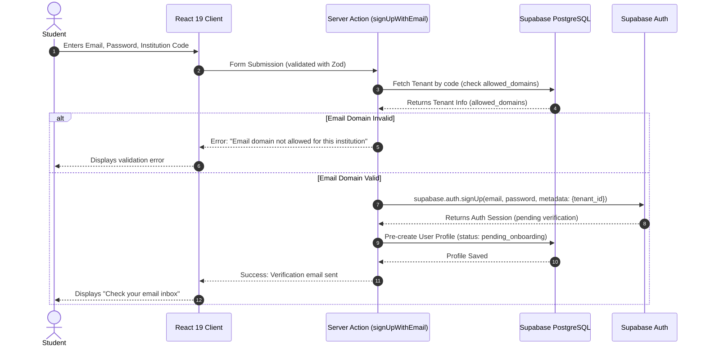
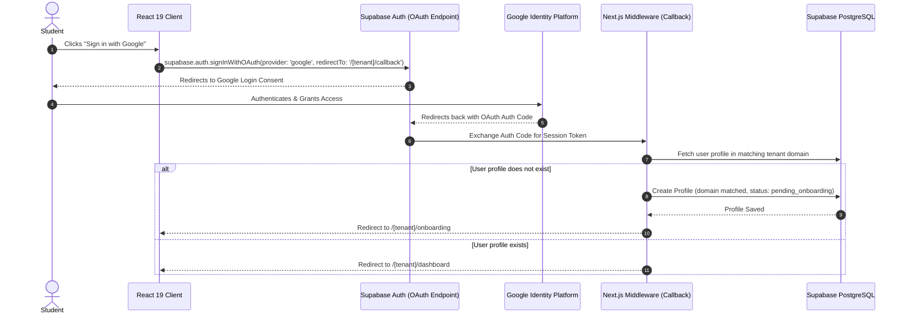
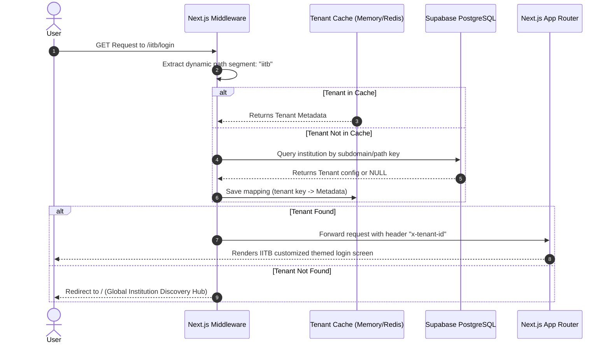
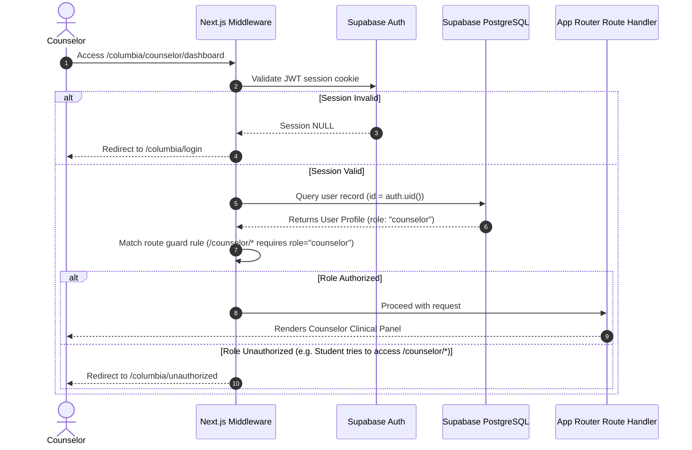

# Authentication and Tenant Flow Sequence Diagrams

This document contains sequence diagrams illustrating the primary workflows of the **MindSpire** authentication and multi-tenant foundation layer.

---

## 1. Email Signup Flow
Students register themselves using their official college email. The domain is verified against the institution's allowed domains list.



---

## 2. Google OAuth Signup Flow
OAuth preserves the tenant context. Upon return, the system links the user to their institution database record.



---

## 3. Tenant Resolution Flow (Path-Based)
Explains how the Next.js middleware inspects path segments to resolve the tenant context and handles fallback redirection.



---

## 4. Onboarding Flow
First-time login setup: profiles are initialized, anonymous handles created, and notifications configured.

```mermaid
sequenceDiagram
    autonumber
    actor Student
    participant Client as React 19 Client (Wizard)
    participant Action as Server Action (submitOnboardingFlow)
    participant DB as Supabase PostgreSQL

    Student->>Client: Submits Real Name, Anon Pseudonym, Notification & Consent Settings
    Client->>Action: Invokes action with onboarding payload (Zod validation)
    
    Action->>DB: Check if Anonymous Pseudonym is unique
    DB-->>Action: Returns validation result (Unique/Duplicate)
    
    alt Pseudonym taken
        Action-->>Client: Error: "Pseudonym already in use"
        Client-->>Student: Prompts to select different nickname
    else Pseudonym unique
        begin transaction
            Action->>DB: Update User Profile (real_first_name, status: active)
            Action->>DB: Insert into anonymous_profiles (pseudonym, avatar_config)
            Action->>DB: Insert into notification_preferences (email, push, in_app)
            Action->>DB: If checked: Insert into consent_grants (counselor_id)
        commit transaction
        DB-->>Action: Operations Succeeded
        Action-->>Client: Success: Onboarding complete
        Client->>Client: Route redirect to /[tenant]/dashboard
    end
```

---

## 5. Role Authorization Guards
Determines access policies based on user roles and route guards.


